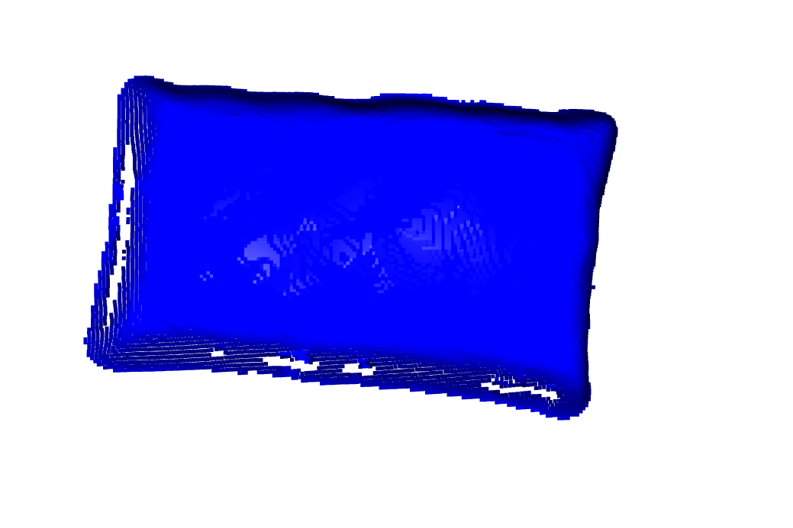
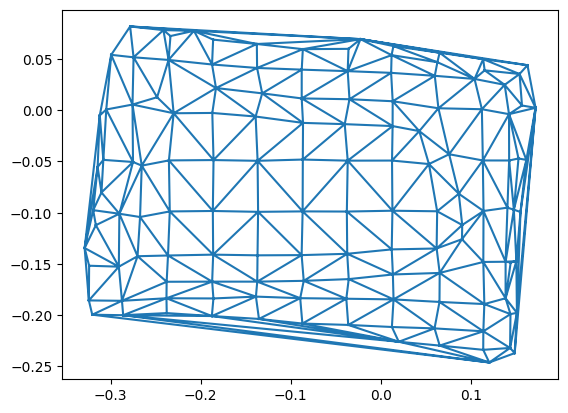
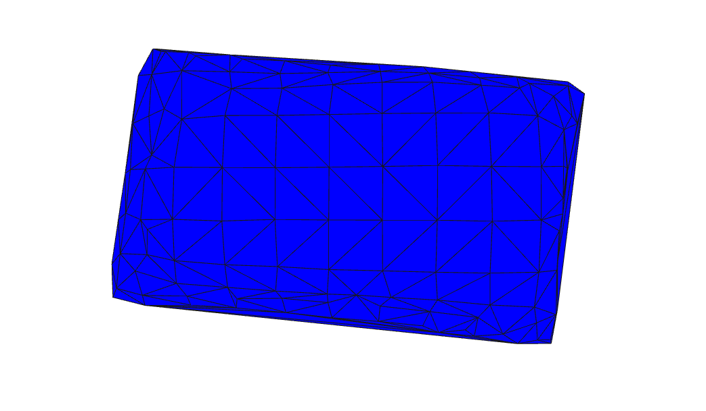

# Stockpile Volume Computation using 3D Point Cloud

This project performs stockpile volume estimation using 3D point cloud data with the help of Open3D and Python.

## Project Overview

The project workflow includes:

- Loading point cloud data
- Ground plane segmentation using RANSAC
- Noise removal
- Point cloud downsampling
- Delaunay triangulation
- Surface mesh generation
- Volume calculation

The final output is the estimated stockpile volume in cubic meters.

---

## Technologies Used

- Python
- Open3D
- NumPy
- SciPy
- Matplotlib

---

## Dataset

The project uses a `.ply` point cloud file containing 3D stockpile data.

---

## Workflow

### 1. Load Point Cloud
The point cloud data is loaded using Open3D.

### 2. Ground Segmentation
RANSAC plane segmentation is used to separate the ground plane from the stockpile.

### 3. Noise Removal
Statistical outlier removal is applied to clean the point cloud.

### 4. Downsampling
Voxel downsampling reduces point cloud density for faster processing.

### 5. Triangulation
Delaunay triangulation is used to create a surface mesh.

### 6. Volume Estimation
The volume under each triangle is calculated and summed to estimate the total stockpile volume.

---

## Screenshots

### Original Point Cloud


### Ground Plane Segmentation


### Cleaned Stockpile Point Cloud


### Triangulation Mesh


### Surface Mesh


---

## Output

Estimated Stockpile Volume:

0.0099 m3

---

## Installation

```bash
pip install open3d numpy scipy matplotlib
```

---

## Run Project

Open and run:

```bash
stockpile-volume-computation/
│
├── src/
│   ├── data/
│   │   └── stockpile.ply
│   └── stockpile_volume.ipynb
├── .gitignore
└── README.md
```

---

## Author

Pratik Pawar